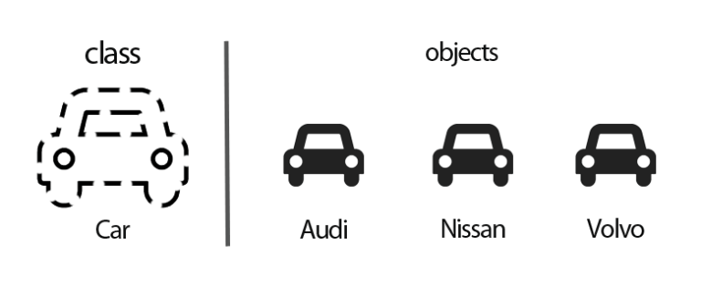

# 01.객체지향

### 객체지향 

- 사물에 대해서는 `객체(Object)` 라고 부르며. 해당 사물이 하는 행위를 `method` 로 정의 하고 해당 사물이 가니는 속성을 `변수(Variable)`라고 정의 합니다.  

### 객체 설계하기

- 객체 ==  사물 == Object

-  각각의 객체(자동차)는 각각의 속성(자동차의 속성),행위(자동차의 움직임)를 가진다.

### 객체 의 3가지 요소 

- 상태 유지 (객체의 상태 )
  - 객체는 상태 정보 저장, 유지 되야 하며 이러한 속성은 변수로 정의. 이러한 속성값이 바뀌면 객체의 상태가 변결 될 수 있어야 한다.

- 기능제공 (객체의 책임)
  - 객체는 기능을 제공 -> Method의 제공으로 이루어진다.
  - 외부로부터 직접 속성에 접근하여 변경하는것이 아닌 객체가 제공하는 Method로 기능이 제공 되어야 한다.

- 고유 식별자 제공 (객체의 유일성)
  -  각각의 객체즌 고유한 식별자를 가져야 한다.
  - 속성을 통해 각각 고유한 값을 줄 수 있으며, 이는 DB에서 키(key)로 작성 가능하다.

### 객체지향의 4대 특성

- 캡슐화
  - 속성이 선언 되었으나 이의 상태를 변경하는 method가 없다면 잘못 선언된 속성 
  - 자신이 가지고 있는 속성에 대해서는 해당 상태를 변경하는 기능을 제공해야 한다.
  - 객체 안의 Method는 객체 안의 속성을 처리해야 하며, 다른 객체를 전달받아 해당 다른 객체에 정의 된 속성을 직접 처리 하면 안 된다.

- 상속 
  - 객체지향에서의 상속은 하위로 내려갈수록 구체화된다.
  - 프로그램 구조에 대한 이해도 향상 -> 최상위 클래스의 구조를 보고 하위 클래스의 동작을 이해 할 수 있다.
  - 재사용성 향상 -> 상속을 이용하여, 해당 클래스에 필요한 속성 및 메소드를 정의 하지 않고, 상속을 받아서 사용할 수 있다.
  - 일관죈 형태의 클래스 객체를 추가 할 수 있어, 간단한 프로그램 확장이 가능
  - 유지보수성 향상
- 다형성 
  - 하나의 개체가 여러 개의 형태로 변화 하는것을 말하며, 이를 객체지향에서도 유사하게 사용 한다.
  - 다형성은 오버라이딩을 통해서 가능 합니다.
- 추상화 
  - 객체 지향에서의 추상화는 모델링이다.
  - 구체적으로 공통적인 부분, 또는 특정 특성을 분리해서 재조합 하는 부분이 추상화 
  - 앞서 다형성, 상속 모두 추상화에 해당.

